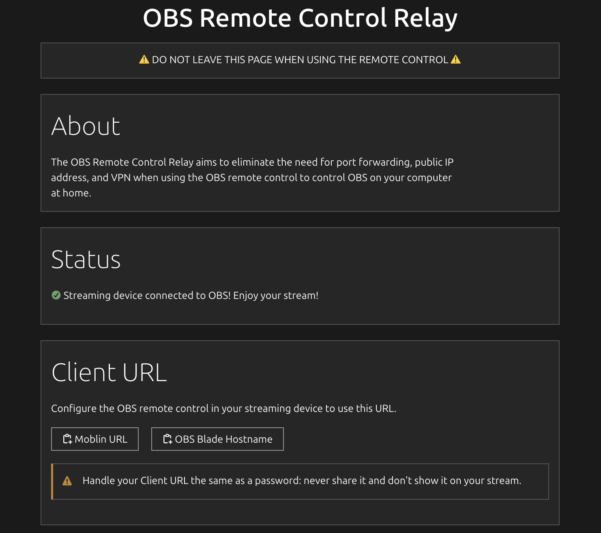

# OBS Remote Control Relay

Example server: https://moblin.mys-lang.org/obs-remote-control-relay



OBS Remote Control Relay provides a simple cloud service with a Go-based backend that serves both a web interface and WebSocket endpoints. This tool enables seamless remote control (like Moblin or OBS Blade ) of OBS through a browser.

You can easily deploy it using Docker or run it as a systemd service. TLS support can be provided via Nginx or Caddy.


## Quick Start with Docker
### 1. Set Up Environment Variables

Copy the example environment configuration and customize it to fit your setup:

```bash
cp .env.example .env
```

### 2.
Deploy the OBS Remote Control Relay easily with Docker Compose:

```bash
docker compose up -d
```


## Manual Way

### 1. Build the Go Program

Clone the repository and navigate to the backend folder to build the Go program:

```bash
cd backend && go build
```

### 2. Set Up Environment Variables

Copy the example environment configuration and customize it to fit your setup:

```bash
cp .env.example .env
```

Edit the values in `.env` as needed (e.g., port, address, etc.).

### 3. Running as a Systemd Service

You can run the relay as a systemd service for automatic startup on boot.

#### Example Systemd Service Configuration

Create a systemd service file at `/etc/systemd/system/obs-remote-control-relay.service` with the following content:

```ini
[Unit]
Description=OBS Remote Control Relay
After=network.target
StartLimitIntervalSec=0

[Service]
Type=simple
Restart=always
RestartSec=1
User=erik
ExecStart=/home/{$whoami}/obs-remote-control-relay/backend/obs-remote-control-relay -address localhost:9999
EnvironmentFile=/home/{$whoami}/obs-remote-control-relay/backend/obs-remote-control-relay/.env
WorkingDirectory=/home/{$whoami}/obs-remote-control-relay/backend
KillSignal=SIGINT

[Install]
WantedBy=multi-user.target
```

#### Enable and Start the Service

To enable and start the service:

```bash
sudo systemctl enable obs-remote-control-relay
sudo systemctl start obs-remote-control-relay
```

---
### 4. Set up webserver

## Setting Up TLS with Nginx

You can proxy the Go application behind Nginx for SSL/TLS support and enhanced performance.

1. **Configure Nginx**  
   Add the following to your Nginx configuration:

   ```nginx
   location /{$RELAY_PATH}/ {
       proxy_pass http://localhost:{$PORT}/;
       proxy_http_version 1.1;
       proxy_set_header X-Forwarded-For $proxy_add_x_forwarded_for;
       proxy_set_header Upgrade $http_upgrade;
       proxy_set_header Connection "Upgrade";
       proxy_set_header Host $host;
       proxy_send_timeout 7d;
       proxy_read_timeout 7d;
   }
   ```

2. **Use Environment Variables (Optional)**  
   If you want Nginx to load environment variables, you can specify the `.env` file in the Nginx service or configuration:

   ```nginx
   EnvironmentFile=/home/{$whoami}/obs-remote-control-relay/backend/obs-remote-control-relay/.env
   ```

3. **Restart Nginx**  
   After making changes to the Nginx config, restart it:

   ```bash
   sudo systemctl restart nginx
   ```

---

## Setting Up TLS with Caddy

Caddy is another great option for handling TLS with minimal configuration. 

To start Caddy using the `Caddyfile` and environment variables:

```bash
caddy start --adapter ./Caddyfile --envfile .env
```

---
