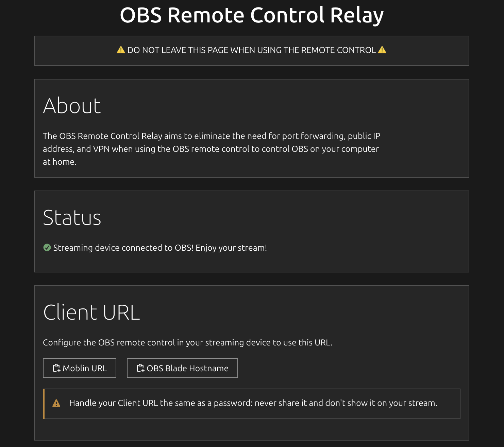

# OBS Remote Control Relay

Server you can use (hosted in Tokyo): https://moblin.mys-lang.org/obs-remote-control-relay



# Cloud service

A simple Go program serves a simple website and websocket endpoints.

## Docker

Pull image from repository:
```bash
docker pull ghcr.io/eerimoq/obs-remote-control-relay:latest

docker run --rm -p 8080:8080 ghcr.io/eerimoq/obs-remote-control-relay
```

### Docker Compose

```yaml
services:
  obs-relay:
    image: ghcr.io/eerimoq/obs-remote-control-relay:latest
    ports:
      - "8080:8080"
    environment:
      - LOG_LEVEL=INFO # Default: 'INFO', Possible: INFO, WARN, ERROR, DEBUG
      # - RELAY_ADDRESS=0.0.0.0:8080 # Default: ':8080', If you change the port here make sure to change the ports section above
      # - RELAY_REVERSE_PROXY_BASE=/obs-remote-control-relay # Default: '/', Set this according to how you have your reverse proxy
    restart: unless-stopped
```


## Systemd (no Docker)

Run the Go program as a systemd service and use Nginx for TLS.

```
cd backend && go build
```

## Systemd service

/etc/systemd/system/obs-remote-control-relay.service

``` ini
[Unit]
Description=OBS Remote Control Relay
After=network.target
StartLimitIntervalSec=0

[Service]
Type=simple
Restart=always
RestartSec=1
User=erik
ExecStart=/home/erik/obs-remote-control-relay/backend/obs-remote-control-relay -address 127.0.0.1:9999 -reverse_proxy_base /obs-remote-control-relay
WorkingDirectory=/home/erik/obs-remote-control-relay/backend
KillSignal=SIGINT

[Install]
WantedBy=multi-user.target
```

Enable it for automatic start at boot.

```
sudo systemctl enable obs-remote-control-relay
```

Start it.

```
sudo systemctl start obs-remote-control-relay
```

## Nginx

```
location /obs-remote-control-relay/ {
    proxy_pass http://127.0.0.1:9999/;
    proxy_http_version  1.1;
    proxy_set_header X-Forwarded-For $proxy_add_x_forwarded_for;
    proxy_set_header Upgrade $http_upgrade;
    proxy_set_header Connection "Upgrade";
    proxy_set_header Host $host;
    proxy_send_timeout 7d;
    proxy_read_timeout 7d;
}
```

Restart it.

```
sudo systemctl restart nginx
```